# example-maven-repository

## Setting up the environment

In a real case scenario, this setup should be deployed probably somewhere in a cloud environment. But because this is
a recruiting task and not an enterprise project, I will show you how to configure it on a local machine. Keep in mind
that some steps require accounts with certain privileges (like my own GitHub account) and specific credentials
(like for the SMTP server). Also, I'm doing some things (like using the Super User account) that I would never do in
a production infrastructure, for the sake of simplicity.

### Setting up TeamCity server instance

For running our server and agents instance, we will be using [Podman](https://podman.io/). Download it and install
according to the instructions on their site.

First of all, in the Podman's "Images" section click on the "Pull" button, type
`docker.io/jetbrains/teamcity-server:2025.11` and then click "Pull image". After downloading, click "Run image" button
to configure the container (this small triangle).

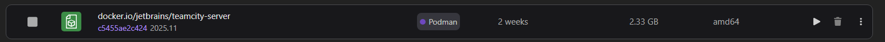

For now no additional configuration is needed, you only need to remember on which port
the container will run (for the rest of guide, let's assume it's 8111, so TeamCity instance will be available under
http://localhost:8111). Click the "Start container" button and wait till it will boot up.

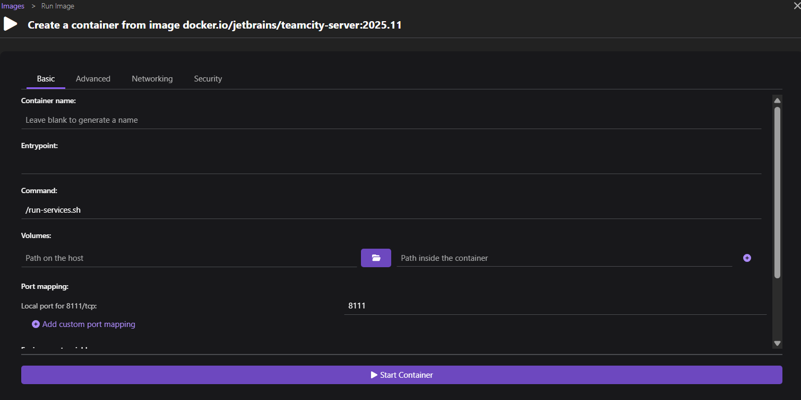

It's now time to perform the first configuration of the TeamCity instance. Go to http://localhost:8111 and wait till the
"TeamCity First Start" screen will appear. Click "Proceed" to initialize the data directory, then "Proceed" to use the
`Internal (HSQLDB)` database type (it's more than enough for our project). Next, agree to the Terms & Conditions by
clicking "Accept" at the bottom of the page. After some time, a login screen will appear. Click "Login as Super user",
then paste the "Super user authentication token" (it will appear under the "Tty" tab in the running container details
in Podman, if you can't see it just refresh the TeamCity page). Now click the "Login" button. An empty TeamCity screen
should appear, congratulations!

### Connecting to the GitHub Project

On the main page of TeamCity instance, click on the "Create project..." button in the middle, and fill the form:
- Project name: `ExampleMavenRepository`
- Project ID: `ExampleMavenRepository`
- Project description: leave empty

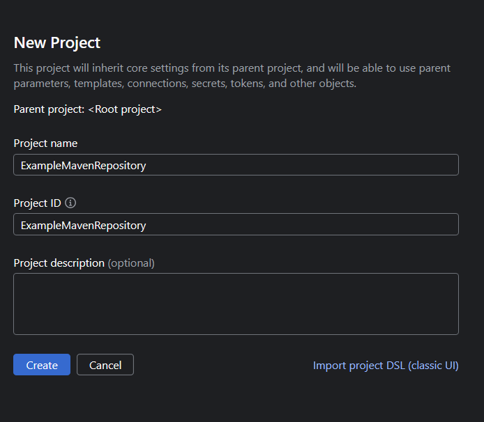

Submit the form by clicking on the "Create" button. This project is hosted on GitHub, so expand this section and click
the "Add" button next to "GitHub.com" option. Register the TeamCity app through your GitHub account by clicking the
"register TeamCity" link. A form on GitHub should appear, fill it:
- Application name: whatever name you like, e.g. "TeamCity for ExampleMavenRepository"
- Homepage URL: copy it from TeamCity connection screen
- Description: leave empty
- Authorization callback URL: copy it from TeamCity connection screen

Click "Register application", a screen with GitHub application details should appear. Copy and paste client id into
the previous TeamCity connection screen. On the GitHub page click "Generate a new client secret", and also copy
and paste it into the TeamCity screen. Click the "Add" button on the connection screen to go to the last screen. On this
screen, click the "Log in" button to be able to select the desired repository, confirm the connection on GitHub. Then
type `ILikeYourHat/example-maven-repository` in the input field, leave the default settings and click the "Create"
button. Congratulations, the TC instance is connected to our project!

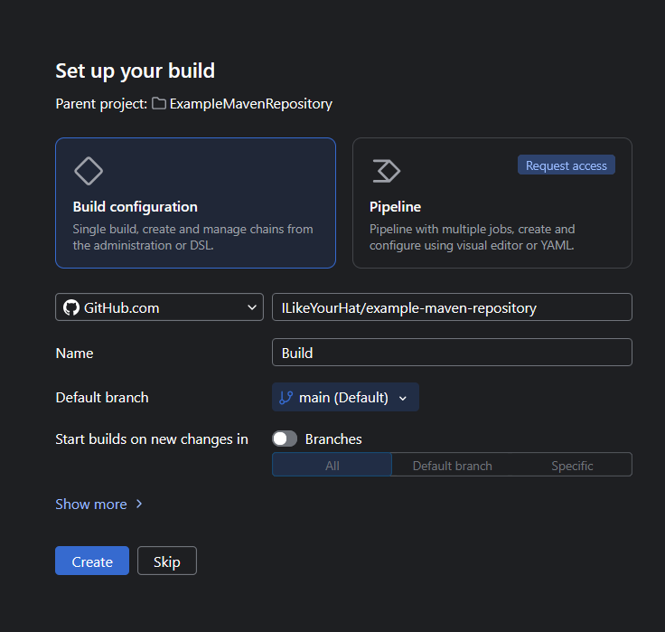

### Enabling Kotlin DSL for our project

Most of the CI logic for our repository is already defined in the VCS in the Kotlin format, so we must import them.
Follow the instructions under
[the official documentation](https://www.jetbrains.com/help/teamcity/kotlin-dsl.html#Getting+Started+with+Kotlin+DSL).
Your configuration should look like this:

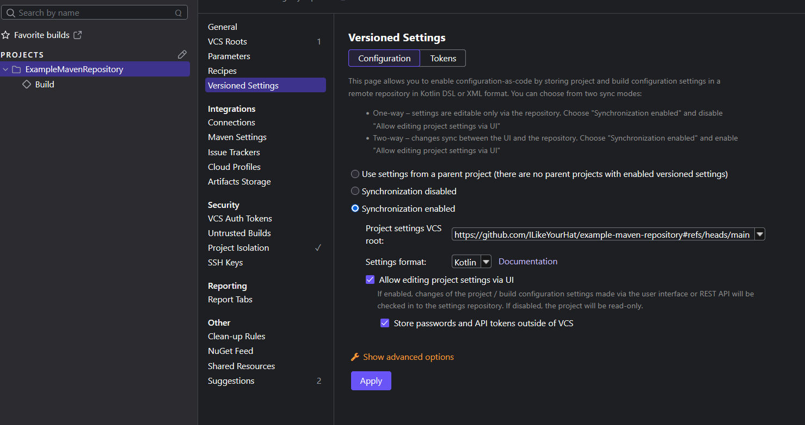

After clicking "Apply", a popup titled "Existing Project Setting Detected". Click "Import settings from VCS" and wait
until the settings will be applied. At the left panel, you should see two build types: "Build" and "Sync release notes".

### Enabling e-mail notifications

To be able to send e-mail notifications (one of the requirements of this recruitment task), we must configure
the Email Notifier on the TeamCity instance. First and foremost, you should create an email account in some external
provider, I'm not going to cover this part because it varies between providers. The important thing is, you need all
the data to establish a connection through SMTP protocol. On my instance I've created an e-mail account
on https://poczta.wp.pl, a well known and free polish e-mail provider.

When you have the account and all the data for the SMTP connection, on the left menu in the TeamCity page click
the "Admin" button and then the "Email Notifier" section. Fill the form as follows:
- SMTP host, SMTP port, SMTP login, SMTP password, Secure connection: fill with the data from your e-mail provider
- Send email messages from: you must fill it with your e-mail address
- Notifications limit: for our purposes, set it to "1"
- Allowed addresses: `*@gmail.com` (we assume that my private e-mail is actually the QA teams' e-mail)

See the image below of how it can be filled. You can click the "Test connection" button to be sure that this
configuration works. When you are done, click the "Save" button.
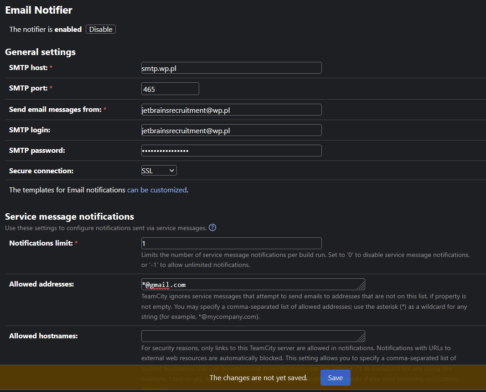

### Setting up SSH keys

In our CI workflows we are using some commands that require pushing and pulling from git server. TeamCity provides no
way to do this besides the initial checkout (as far I as know), so we must set up our own SSH connection to do this.

On the main page of TeamCity, select our project ("ExampleMavenProject") on the projects list, and then click "Settings"
button on the right top corner of the page. Navigate to the "SSH keys" section, and click "Generate SSH key" button.
Leave the default type, and call it "GitHub push key" (the name is important, because it's used in the CI scripts!).
Click the "Generate" button.
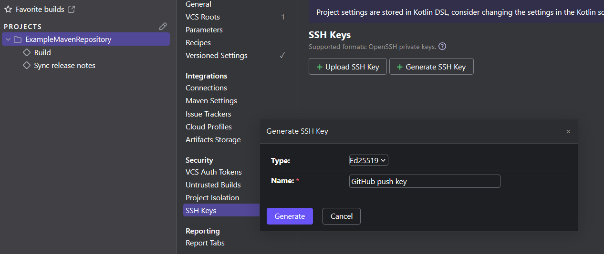

Copy the generated public key, and follow
[this tutorial](https://docs.github.com/en/authentication/connecting-to-github-with-ssh/managing-deploy-keys?versionId=free-pro-team%40latest&productId=authentication&restPage=connecting-to-github-with-ssh%2Cadding-a-new-ssh-key-to-your-github-account#set-up-deploy-keys)
to add this key to your project. Few important things:
- Don't generate a new key, just use the one you've just copied
- After pasting it, remove the comment at the end (in my case, the key was not working with it)
- Make sure to check the "Allow write access" box

Save this deploy key. We are now one step away from running our first CI build!

### Setting up TeamCity agent instance

We have now a fully configured TeamCity instance, but still no way to run our first workflow. To do this, we must
create and run our first TeamCity agent instance.

First of all, because of some external dependencies, we must build our own custom TeamCity agent image. To do this, open
Podman, click on the "Images" tab on the left, and then "Build" button on the top right. As the Containerfile path,
select the `TeamCityAgentDockerfile` located in the `.teamcity` directory. Pick the name you like,
e.g. `custom-teamcity-agent`, and click "Build" button. Wait till building the image will finish.
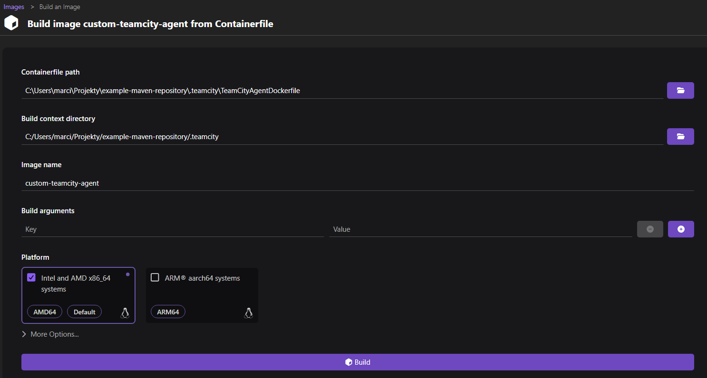

Now when the image is ready, run it. There are however two things to configure before it can be started:
- add the environment variable `SERVER_URL` with the TeamCity server instance address, in our case: http://localhost:8111
- on the "Networking" tab, under "Select container networking section", select the "Use another container networking
stack" and then point to the container with the TeamCity server instance.

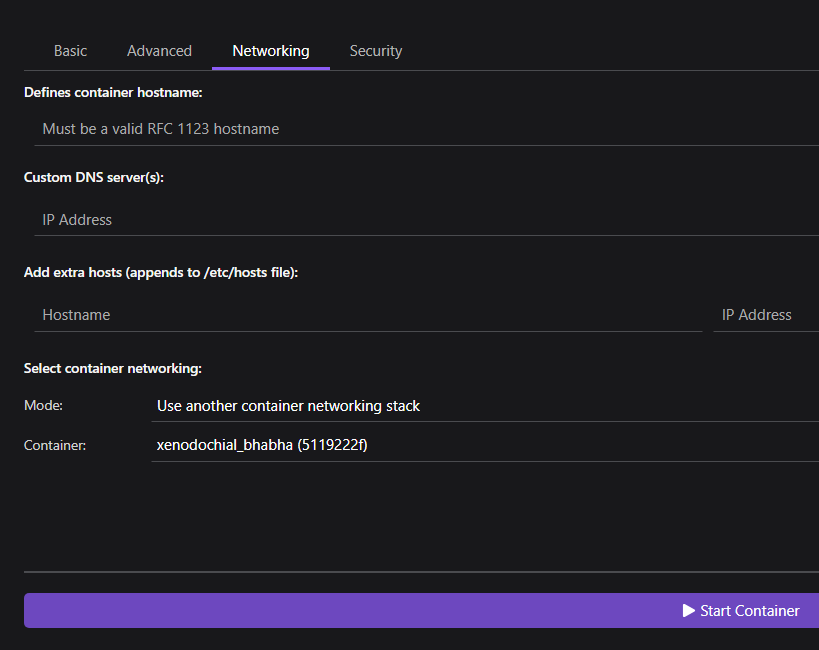

After that, click the "Start container button". Then go to the TeamCity server page, and click the "Agents" button
in the left panel. Wait till the agent will be ready and connect to the server, click "Authorize..." and add it to
the default pool.

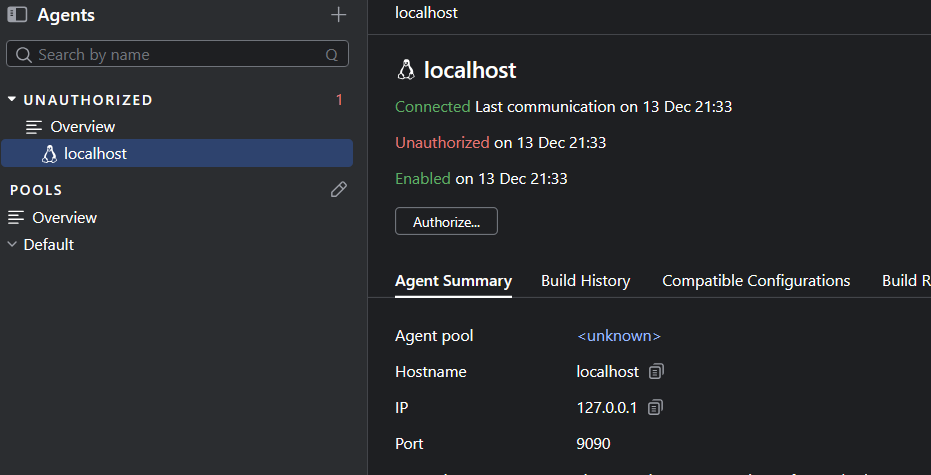

### Running our workflow

After everything is set up, it's time to test if everything was done correctly. On the left panel, click the "Build"
workflow and in the top right corner click the "Build" button. If everything was done correctly, the build should pass.

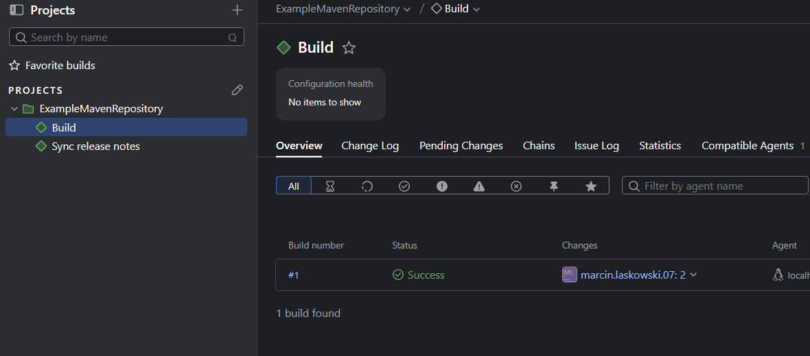

## CI workflow explained

The CI workflows logic is stored in the [settings.kts file](.teamcity/settings.kts). Feel free to explore it while you
are reading my detailed explanation.

### Sync release notes

Let's look closer what is actually happening in the workflow we just run. Let's start with the 'Sync release notes'
workflow. Our initial goal was to download the latest release notes from a marketing team's website and include it in the
output. There are also few restrictions that narrow down the possible solutions:
- our build must be reproducible, and fetching data from external, rapidly-changing source prevents this
- our build must handle release notes server unavailability, so it doesn't fail
- our build must try to provide as recent version of release notes as possible

Because of those requirements, I've decided that the best solution will be periodically downloading the release notes
and storing them in our repo. Thanks to this:
- we are not breaking reproducible builds (because the actual build is not using the remote content)
- handles release notes server unavailability (it just takes the most recent version of them stored in repository)
- provides as recent version of release notes as possible (syncing it every day, and also before the actual build to
handle last-minute changes)

So the actual flow looks as follows:
- Every day at 6am TeamCity is running the sync workflow.
- In the first script, we are downloading the release notes page. We remove everything that was downloaded, and then
download the whole page using the `wget` command (bundled in the customized build agent).
- In the next script, we are playing with git. After some initial setup, we are checking if there are any changes in
the release notes directory. If no, the script ends. If yes, we are commiting those files to the repository, using the
SSH deploy key from the TeamCity instance.
- We are also exposing the current commit (with or without changes) as a output parameter, but more about it later.
- This workflow of course might fail if the release notes server is not available, but this is fine, because this is not
the workflow that provides the distribution archive. Also, it is good to know how recent the release notes are: if the
marketing server is not available for a week, maybe it is a good idea to let them know ;)

### Build

This is the actual workflow that produces the distribution archive. The actual flow looks as follows:
- The build is invoked only manually, so the developers have control when they want to deliver the archive to the QA team.
- First of all, we are using chain builds to invoke "Sync release notes" one more time before the actual build. We are
however ignoring the actual result, so it cannot affect the further execution.
- The first step, "Update HEAD if necessary", analyzes if the release notes changed because of previous sync, by
comparing the output commit from previous build with the current commit. If they differ, the scripts performs checkout
to the updated commit. If the output commit is missing (because the previous build fail), the script is skipped.
- Now, in the next step, we can finally perform the actual build. We are executing two maven commands: `javadoc:javadoc`
to generate the required javadoc pages, and `assembly:single` to pack them together with the release notes in a single
distribution archive.
- The distribution archive is then marked as artifact, so the QA team will be able to download it easily from the build
page. I'm assuming that the QA team have the necessary technical knowledge and TeamCity accounts to do this.
- Also, at the end of a successful build, an e-mail is sent to the QA team to notify them. In the code it is represented
as my personal e-mail.

## Reproducible builds config explained

I've managed to make the result of executing the `./mvnw javadoc:javadoc assembly:single` command byte-to-byte
reproducible between the TeamCity agent (using Ubuntu 24.04.3 LTS) and my personal computer (using Windows 11). I've
verified it uploading both artifacts to the https://try.diffoscope.org/ page.

What I've done to achieve this:
- Not trying to download the release notes page as the part of maven build, because this is an external resource, that
might change without notice.
- Not depending on the version of Maven build tool installed, but instead using the
[Maven wrapper](https://maven.apache.org/tools/wrapper/) approach.
- Using JDK toolchain plugin to force building using only Amazon Corretto 21.0.9. I found out that different versions
of JDK platform can generate different javadocs, the main issue being the bundled jQuery version.
- Good practices like defining the maven plugin versions inside `pluginManagement` block.
- Adding `project.build.outputTimestamp` property to erase actual timestamps from archived files
- Unifying line endings between OSes when creating the archive files ([here](assembly/zipJavadocAndReleaseNotes.xml)).
- Excluding the `legal` directory from the generated javadoc: for some reason, the build on CI was producing the actual
Java licenses, and on local machine I had only references to them. I couldn't figure out why (even using exactly the
same JDK didn't help), so I've decided for now to exclude this folder from the archive. I think it is a good enough
approach for a QA build. If you think different, I could also store those license files in the repo and replace
them in the final archive, overwriting the non-reproducible ones.
